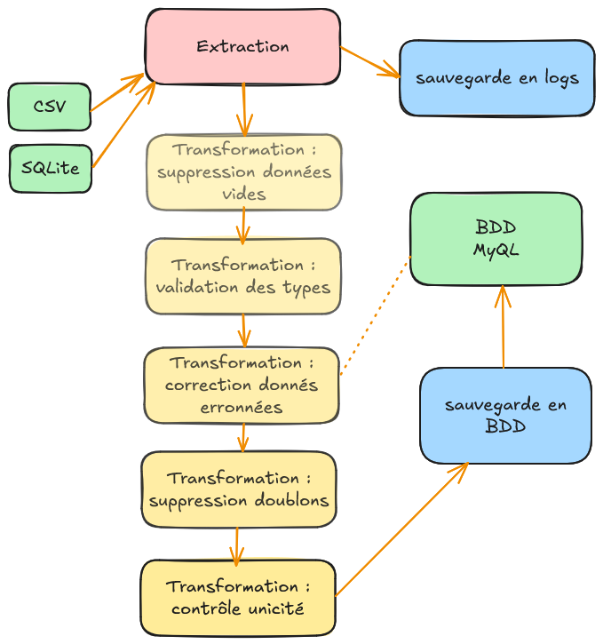

# 🧪 Projet ETL Python – Suivi des commandes revendeurs

## 📚 Table des matières

- [ 🧾 Présentation](#present)
- [ 🎓 Objectif pédagogique](#objectif)
- [ 🛠️ Fonctionnalités](#fonction)
- [ 💻 Pré-requis](#prereq)
- [ 🧑‍💻 Stack technique](#stack)
- [ ⚙️ Installation & mise en route](#install)
- [ 📝 Guide de développement](#guide)
- [ 🧬 Pipeline ETL](#pipe)
- [ ✓✓ Tests unitaires](#tests)
- [ 🧩 Structure du projet](#struct)
- [ 📤 Données manipulées](#donn)
- [ ✅ Livrables attendus](#livr)
- [ 📜 Licence](#lic)
- [ 👥 Créateurs](#creat)
- [ ✅ À venir](#aven)

<a id="present"></a>

## [ 🧾 Présentation](#présentation)

Ce projet est un **Proof of Concept (PoC)** académique développé dans le cadre du module _Extraction, Transformation, Chargement (ETL)_ de la formation **Développeur IA** ISEN / Simplon.co.

Il a pour but de concevoir un pipeline **ETL automatisé en Python**, permettant l'intégration des données de commandes revendeurs (au format CSV) et de stocks/production (via une base SQLite), dans une **base de données MySQL centralisée**. L'aboutissement du pipeline est la mise à jour de la base stock, avec création de fichiers csv pour le suivi des stocks par produits et par revendeur. Le tout est actuellement **sans interface graphique**, en interaction terminal uniquement.

Le développement de ce projet a suivi une méthodologie Agile, avec ticketing et feuille de route sur
[Notion](https://www.notion.so/ba8a83033c684aa798eb9e7c6e2e2ed6).

---


<a id="objectif"></a>

## [ 🎓 Objectif pédagogique](#objectif-pédagogique)

- Concevoir une base SQL relationnelle orientée gestion logistique (revendeurs, produits, régions, commandes, stocks),
- Développer un pipeline ETL pour :
  - Extraire les données CSV & SQLite,
  - Valider et nettoyer les données (cohérence, format, doublons...),
  - Charger les données dans une base **MySQL conteneurisée**,
- Générer un rapport CSV de l’état des stocks à date,
- Automatiser le traitement dans une architecture modulaire.

---

<a id="fonction"></a>

## [ 🛠️ Fonctionnalités](#fonctionalités)

- Intégration automatisée des commandes et stocks dans une base MySQL.
- Validation et nettoyage des données (formats, doublons, cohérence).
- Génération de fichiers CSV récapitulatifs.
- Architecture modulaire pour faciliter le développement et la maintenance.

---

<a id="prereq"></a>

## [ 💻 Pré-requis](#pré-requis)

- Python 3.12+
- Docker + Docker Compose installés
- `pip`, `venv` disponibles en ligne de commande

---

<a id="stack"></a>

## [ 🧑‍💻 Stack technique](#stack-technique)

| Outil / Techno          | Version / Remarques                         |
| ----------------------- | ------------------------------------------- |
| Python                  | ≥ 3.12                                      |
| Pandas                  | 2.3 Manipulation de données structurées     |
| mysql-connector         | 9.3 Bibliothèque d'interaction avec MySQL   |
| python-dotenv           | chargement des variables d'environnement    |
| pytest (et pytest-cov)  | Bibliothèques de test et couverture         |
| Docker / Docker Compose | Conteneurisation de la base MySQL + Adminer |
| MySQL                   | 8.0+ BDD relationnelle (Port 3307)          |
| Adminer                 | Interface web pour MySQL (Port 8081)        |
| SQLite                  | Base légère Stock source                    |
| CSV                     | Fichier Commandes des revendeur             |
| VSCode                  | IDE de développement local                  |

---

<a id="install"></a>

## [ ⚙️ Installation & mise en route](#installation--mise-en-route)

### 1. Clonage du dépôt

```bash
git clone https://github.com/TangiLC/isenIA_distributech.git
cd etl
```

### 2. Création du fichier d'environnement et de la base de données

Un fichier contenant les données d'environnement de votre BDD est nécessaire à la racine du projet.
Créer et personnalisez le fichier `.env` selon ce schéma ou copier/renommer le fichier `.env.template`:

```bash
BDD_HOST=votre-adresse-host (localhost)
BDD_PORT=votre-port-mysql (3307)
BDD_USER=votre-nom-user-mysql
BDD_PASSWORD=votre-mot-de-passe-mysql
BDD_NAME=votre-nom-de-bdd (distributech)
```

### 3. Création de l’environnement virtuel Python

```bash
python3 -m venv .venv
source .venv/bin/activate
```

### 4. Installation des dépendances

```bash
pip install -r requirements.txt
```

### 5. Lancement de la base de données

Les fichiers `bdd/script.sql` et `bdd/populate_init.sql` permettent d'initialiser votre base de données.

Alternativement, Dans le dossier `bdd/`, un fichier docker-compose permet de conteneuriser une bdd :

```bash
docker-compose up -d

```

> 📌 La base **MySQL** sera alors accessible sur le port `3307`  
> 🖥 L'interface **Adminer** est disponible via [http://localhost:8081](http://localhost:8081)

Lancer les scripts d'initialisation depuis l'interface Adminer.

---

<a id="guide"></a>

## [ 📝 Guide de développement](#guide-de-développement)

- Scripts principaux dans scripts/
- etl.py : script principal pour exécuter le pipeline
- scripts/extracts.py : extraction des données
- scripts/transform_xx.py : transformation et nettoyage
- scripts/loads.py : scripts pour les étapes Load
- scripts/generate_report.py : génération CSV état stocks

---

<a id="pipe"></a>

## [ 🧬 Pipeline ETL](#pipeline-etl)

-Schéma


### 📤 Extract

- Chargement des **commandes revendeurs** depuis un ou plusieurs fichiers `.csv` au format :

```
numero_commande,commande_date,revendeur_id,region_id,product_id,quantity,unit_price
```

- Connexion à une base **SQLite** pour lire :
  - Liste des produits
  - Répartition des revendeurs par région
  - Stock actuel

### 🧹 Transform

- Validation des données (formats de date, types, cohérence produit/revendeur)
- Nettoyage des doublons
- Normalisation (majuscule/minuscule, encodage, etc.)

### 📥 Load

- Mise à jour de la base MySQL cible via `mysql-connector-python`
- Génération des fichiers `.csv` récapitulatif de l’état des stocks à date
- Déplacement des fichiers sources traités

---

<a id="tests"></a>

## [ ✓✓ Tests unitaires](#tests-unitaires)

Les bibliothèques _pytest_ et _pytest-cov_ est configurée avec pytest.ini et .coveragerc.
Les tests sont à lancer à la racine du projet avec la commande suivante :

```
pytest --cov=scripts --cov-report=term --cov-report=html:tests/htmlcov --cov-config=.coveragerc
```

Le coverage sera affiché dans le terminal, avec un objectif >80%.
Le rapport se trouve dans `/tests/htmlcov`. (page principale `index.html`)

---

<a id="struct"></a>

## [ 🧩 Structure du projet](#structure-du-projet)

```
distributech/
├── etl.py                   # Script principal du pipeline (main)
├── scripts/
│   ├── extracts.py          # Scripts pour les étapes Extract
│   ├── transform_xx.py      # Scripts pour les étapes Transform
│   ├── loads.py             # Scripts pour les étapes Load
│   ├── generate_report.py   # Scripts pour la génération de l'état des Stocks
│   └─utils/                 # Scripts annexes (mise en forme, requêtes...)
├── bdd/
│   ├── script.sql           # Script de création des tables pour mySQL
│   ├── populate_init.sql    # Script d'alimentation initiale de la BDD (produits, régions)
│   └── docker-compose.yml   # Lancement base MySQL + Adminer en container
├── data/
│   ├── commandes_xxx.csv    # source CSV (Commandes)
│   ├── base_stock.sqlite    # Base SQLite (production/réapprovisionnement)
|   └──archived/             # Dossier archive des fichiers antérieurs
├── sql/
│   └── schema.sql           # Script de création des tables pour mySQL
├── tests/
│   └── test_xxxx.py         # Scripts de tests unitaires pour l'ensemble des fonctions
├── requirements.txt         # Dépendances Python
├── README.md                # Ce fichier 😄
├── env.template             # template du .env à personnaliser
├── pytest.ini, .coveragerc  # Fichiers de configuration de l'outil pytest
└── .gitignore               # Liste des répertoires ou fichiers non suivis
```

---

<a id="donn"></a>

## [ 📤 Données manipulées](#données-manipulées)

- **Commandes** : `numero_commande`, `commande_date`, `revendeur_id`, `region_id`, `product_id`, `quantity`, `unit_price`
- **Stocks** : mouvements (entrées/sorties), calcul des niveaux à date
- **Revendeurs** : `revendeur_id`, `revendeur_name`, `region_id`
- **Régions** : `region_id`, `region_name`
- **Produits** : `product_id`, `product_name`, `cout_unitaire`

---

<a id="livr"></a>

## [ ✅ Livrables attendus](#livrables-attendus)

- Scripts Python du pipeline ETL (`etl.py`) et annexes (`/scripts/`)
- Fichier SQL pour initialiser la base [script.sql](./bdd/script.sql) et population [populate.sql](./bdd/populate_init.sql)
- Fichier `.csv` généré de l’état des stocks à date [exports](./exports/)
- Documentation fonctionnelle (ce `README.md`)
- Cahier des charges fonctionnel [cdc](./documentation/ditributech_cdc.pdf)
- Cahier des charges technique [cdc_t](./documentation/distributech_cdc_t.pdf)

---

<a id="lic"></a>

## [ 📜 Licence](#licence)

Ce projet est sous licence **MIT** – voir le fichier [LICENSE](LICENSE) pour plus de détails.

---

<a id="creat"></a>

## [ 👥 Créateurs](#créateurs)

Ce projet est réalisé en trinôme, les contributeurs sont :

_Carole_ <a href="https://github.com/Carole-N" target="_blank">

</a>
_Gosia_ <a href="https://github.com/go2375" target="_blank">

</a>
_Tangi_ <a href="https://github.com/TangiLC" target="_blank">

</a>

---

<a id="aven"></a>

## [ ✅ À venir](#à-venir)

- Factorisation et sécurisation
- Tests de robustesse sur les différentes étapes ETL
- Affiner les vues BDD selon les exigences métier

---

**Bonne lecture !**
